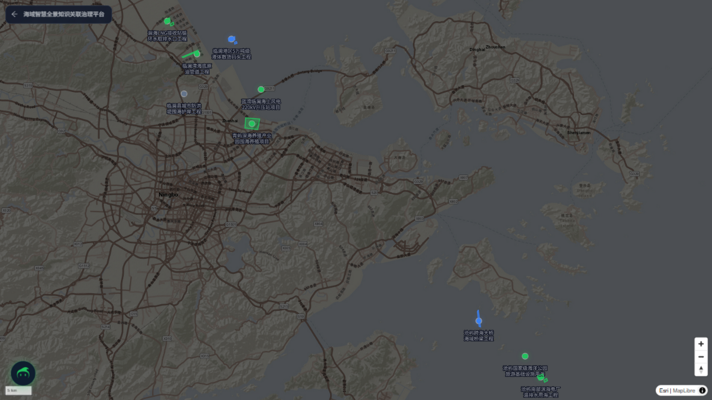
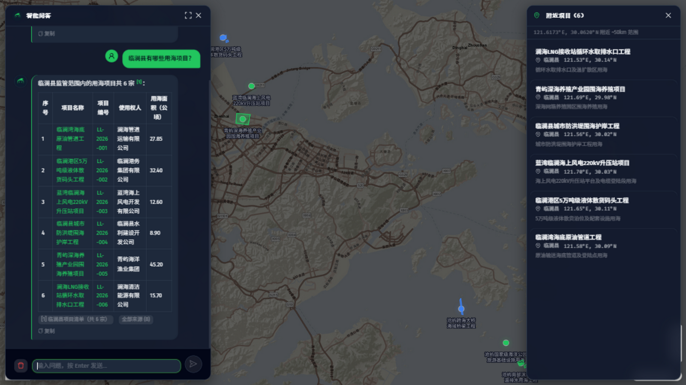
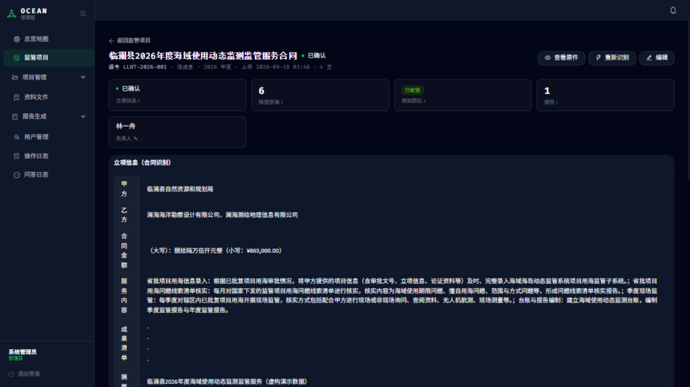
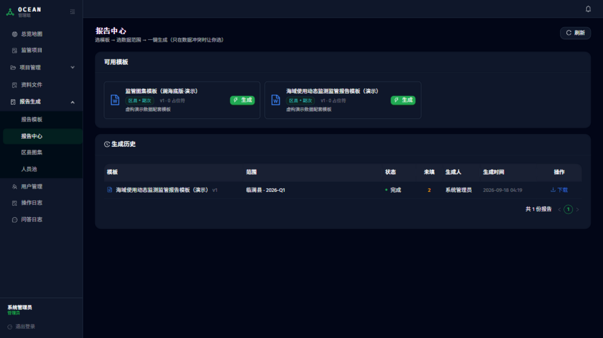

# 问海 —— 海域智慧全景知识关联治理平台 · 作品架构与设计方案

> **「地矿杯」AI 智能体创新应用大赛 · Agent 开发应用类（团队赛）参赛作品**
> 版本 V3.0（叙事重构版）· 2026-09-29 · 密级：公开材料
> **在线演示：http://150.158.118.131**（前台免登录可直接体验；管理端演示账号随提交材料单独提供）

---

## 一、开场：小张的一个下午

> 周四下午四点，临澜县的海域监管员小张接到电话：领导半小时后要听「临澜湾海底原油管道工程」的情况汇报，需要项目的用海期限、面积、最近一次核查发现了什么。
>
> 放在半年前，小张要打三个电话、翻两个人电脑里的文件夹、再从一份 40 页的核查报告里找段落——顺利的话 20 分钟，不顺利要等到明天。
>
> 现在，小张打开问海，输入一句话：**「临澜湾海底原油管道工程的用海期限多久？最近一期核查发现了什么？」**
>
> **30 秒后**，他拿到了答案：用海期限 30 年、面积 27.85 公顷、二季度核查发现施工便道超范围 0.3 公顷已责令整改——每个结论后面都带着 [1][2] 角标，点开是原始记录的原文和数据期次。他顺手点了一下回答里的项目名，地图自动定位到项目位置；再点「生成报告」，一份格式完整的季度监管报告草稿已经排好版等他审核。
>
> 领导要的三件事，小张用一次提问和一次点击交齐了。

这不是设想，是**公网演示环境里实测发生的操作**。本文要讲的就是：这件事背后的系统是怎么构成的，以及它为什么能在真实监管业务里落地。

---

## 二、我们解决什么问题：四个每天都在发生的场景

海域使用监管的基本单元是「**一个区县一份监管合同 → 多个用海项目（宗海）→ 按季度现场核查**」。一个中等规模的监管合同，一年沉淀下来的资料是：合同扫描件、数百份核查记录与现场照片、多期用海矢量图件、若干份动辄数十页的核查报告。四个场景随之每天上演：

**场景 1 ·「资料在谁电脑里？」**
资料分散在经手人各自的电脑里，靠文件夹命名和个人记忆管理。新来的同事想找一份前年的核查记录，要问三个人、翻几十个文件夹——找到时往往已经过了下班时间。

**场景 2 ·「扫描件看不动」**
合同和报告大多是扫描件：文字选不中、搜不到、统计不了。新接手项目的人要花数周通读纸面材料才能上手，老同志脑子里的「哪个数在哪份文件」无法传递。

**场景 3 ·「一期报告，一个星期」**
季度监管报告靠人工从各处摘数、贴照片、排版。多人天的工作量之外，更麻烦的是口径不一与漏图漏项——报告返工是常态。

**场景 4 ·「人走了，经验就走了」**
「哪类问题该查哪类资料」「报告的规范写法」都长在老同志身上。人员一调动，工作质量立刻波动，新人从头再踩一遍坑。

这四个场景指向同一件事：**监管资料没有被组织成"可用"的知识**。问海要做的，就是这一件事。

---

## 三、核心方案：一句话与一条闭环

**一句话**：把分散的合同、台账、照片、图件汇聚成一个**可对话、可检索、可出报告**的知识库——让监管人员**用一句自然语言查遍全部资料，用一次点击生成规范报告**。

**一条业务闭环**（用户视角的完整流程）：

```
📍 地图/提问找到项目 → 💬 一句话提问 → 🔍 平台语义检索真实资料
   → 💡 回答+原文引用 → 👆 人工核对原文 → 📄 一键生成报告草稿
   → ✅ 人工审核定稿 → 🗂️ 季度资料滚动汇入，知识库持续增厚
```

注意闭环里的两个人工节点：**引用可点开核对**与**报告人工定稿**——这是刻意设计，后文「边界」一节专门说明。

产品形态：B/S 网页应用，浏览器直达、免安装；Docker 三容器一体化交付，**既能跑在公有云上（本次参赛的公网演示环境即是），也能整体搬进客户内网全离线运行**——监管数据不出内网。

---

## 四、四大 AI 能力：回到小张的一天

四大能力不是四个功能模块，而是小张工作里的四个时刻。

### 4.1 一张地图看全辖区 —— 全景地图智能检索



打开「项目检索」，全辖区项目以色点与用海矢量色块呈现在地图上（绿=进行中、蓝=已完成、灰=已归档）。悬停见要素、点击开详情、点空白处自动列出**周边约 50 公里**内的项目。小张向领导汇报「全县用海态势」时，第一页永远是这张图。

### 4.2 像问一个老监管 —— AI 智能问答（检索增强生成）



开场故事里那次 30 秒的问答，机制上分三步：先由本地化向量模型（bge-m3，1024 维）对全部资料做**语义检索**——即使提问用词与资料原文并不一致，也能"按意思"命中；再把命中的原文片段交给大模型**归纳作答**；回答**只允许基于平台内真实资料**，每个结论附 [1][2] 角标，点开即见原文与数据期次。支持多轮追问、限定单个项目内提问、回答提及项目时地图自动定位。

对监管业务最要紧的一条：**答案可核验、可溯源**——这是"敢用"的前提。

### 4.3 扫描件变台账 —— 合同 AI 识别



上传监管合同扫描件（PDF），OCR 逐页识别 + 大模型抽取，自动读出甲方、乙方、合同金额、服务内容、成果清单，进入**草稿核对**界面等人工确认。**实测：4 页扫描件从上传到抽取完成 20 秒**，甲乙方与金额抽取准确——小张从此不必对着扫描件逐字摘录，但最终入库的每个字段都经过他核对。

### 4.4 一次点击出报告 —— 报告智能生成



报告模板用 Word 内容控件定义占位符（字段/表格行/章节循环/图位），管理员在 OnlyOffice 里所见即所得地在线维护。点「生成」时平台自动组装项目数据、核查记录、团队名单与图集照片，**生成前数据预检**逐项列出缺项、一键跳转补齐。小张拿到的是一份**排好版的草稿**——终稿永远由人签署。

---

## 五、它不是 Demo：业务闭环与实测数据

一个系统"能落地"的证据是回答四个问题：

**① 用户从哪进入？** 两条路：免登录的「项目检索」（地图+问答，面向业务人员与领导）和账号登录的管理端（面向 PM 与管理员，按项目负责权限隔离）。公网演示环境即是这条完整路径，评委现在就能体验。

**② 结果如何验证？** 每个回答带角标引用，点开对原文；每份报告的每个数字可回溯到平台内的项目与核查记录。**验证不需要信任 AI，只需要核对原文。**

**③ 出错如何补救？** 回答在资料不足时如实说「现有资料不足」，不编造；识别结果、报告内容全部留有草稿-确认两态，人工可改可重生成；平台记录全部操作日志。

**④ 数据如何更新？** 每季度核查清单 Excel 批量导入（自动字段映射、表格内嵌照片提取、同项目同期次自动去重），矢量 .gdb 导入自动挂接项目——资料随业务滚动增厚，知识库越用越全。

**公网演示环境实测数据**（2026-09-23，腾讯云 2核4G 环境）：

| 实测项 | 结果 |
|--------|------|
| 合同 AI 识别全链路（上传→OCR→抽取→待审核） | **20 秒**，甲乙方/金额准确 |
| 智能问答响应 | **秒级**返回，附引用角标与来源列表，三类典型问题全部命中 |
| 报告生成 | 数据预检**零缺失、零冲突**，一键成稿（团队/图集自动落位） |
| 地图检索 | 9 项目点位与矢量公网加载正常 |

**边界声明（我们对 AI 的使用原则）**：问海定位是**辅助决策系统，不做最终裁决**——合同要素 AI 抽取后须人工确认，报告由 AI 组装草稿、人工审核定稿，回答只基于库内真实资料并强制附引用。不承诺"100% 准确"，承诺"每个结论可核验"。

---

## 六、技术亮点：技术服务业务

> 本节面向技术评审。三条差异化，每条先说业务价值，再说技术实现。

**亮点 1 · 问答-引用-地图联动闭环（监管敢用 AI 的前提）**
业务价值：监管答复必须可溯源。实现：RAG 架构，pgvector 单库同时管理 GIS 空间与语义向量（一套数据库支撑地图与检索，运维门槛适合地市客户）；回答强制绑定原文引用并联动地图定位。

**亮点 2 · SDT 内容控件报告引擎（复杂报告也能模板化）**
业务价值：多人天的报告组装压缩为分钟级，且格式绝对统一。实现：基于 Word 内容控件（SDT）的渲染引擎（python-docx + lxml），支持字段替换/表格行克隆/章节循环/自动插图四类占位符——比文本替换式引擎强在能处理带循环结构的复杂报告；引擎与海域业务零耦合，可独立复用。

**亮点 3 · 全离线私有化 AI（数据安全不是妥协项）**
业务价值：监管数据不出内网。实现：大模型走 OpenAI 兼容接口可插拔（云端 API 与内网开源模型一键切换，不锁定厂商），向量与 OCR 均可本地化部署；公有云演示与客户内网生产是同一套镜像。

```
浏览器 (http://<服务器地址>/)
   ├─ 应用服务容器（网页+API，Python FastAPI）
   │    ├─ AI 大模型 ──▶ OpenAI 兼容接口（云端 API / 内网本地模型，可插拔）
   │    ├─ 语义向量 ──▶ 本地向量化服务（bge-m3，1024 维）
   │    ├─ OCR ──────▶ PaddleOCR（容器内本地识别，纯 CPU 可跑）
   │    └─▶ PostgreSQL 16 + PostGIS（空间）+ pgvector（向量）
   │        + OnlyOffice 文档服务容器（模板在线编辑）
   └─ 报告引擎：SDT 四类占位符渲染（python-docx + lxml）
```

功能完成度：七个功能模块（地图检索/智能问答/合同识别/项目管理/矢量数据/报告生成/系统管理）全部实现并实测通过；演示环境内置 2 份合同、9 个宗海项目、16 期核查记录、33 个问答索引块，覆盖全部功能链路（演示数据为虚构数据，用于涉密合规的公开演示）。

---

## 七、推广：从海域监管到自然资源条线

平台的数据模型（**合同 → 项目 → 核查 → 报告**）与 AI 链路（**问答/识别/报告**）与海域业务解耦，可低成本复制到：海洋调查数据管理、地灾治理项目管理、矿山修复监管、耕地保护监测等自然资源条线，以及任何「资料汇总 + 检索问答 + 周期性报告」场景的政企事业单位。

迭代路线：近期（已完成）海域监管全链路 → 中期报告引擎独立为通用批量报告工具、无人机照片自动归属矢量分析 → 远期规范知识库与报告合规性自动审查。每一步都基于已验证的底座做加法，不做远期空许诺。

---

## 八、结语：请记住三件事

如果只带走三件事，我们希望是：

1. **一句话**——把全部监管资料变成可对话、可检索、可出报告的知识库；
2. **三个数字**——合同识别 **20 秒**、问答 **秒级**且答案可溯源、报告**分钟级**草稿+人工定稿；
3. **一条原则**——AI 负责找料与组装，人负责核对与拍板。

---

## 附录 A · 与大赛评审维度的对应

| 评审维度 | 对应点 |
|---------|--------|
| 业务价值：紧扣五大产业、解决核心业务痛点 | 对接「自然资源资产经营保护 + 资源空间安全利用保障」；四个日常场景逐一化解（§2） |
| 技术创新：智能体架构、行业差异化亮点 | 引用溯源-地图联动闭环；SDT 报告引擎；全离线私有化（§6） |
| 推广价值：批量推广、迭代升级 | 数据模型业务无关、Docker 离线交付、模型可插拔（§7） |
| 作品完成度：原型完整、运行稳定 | 七模块全实现并实测；**公网演示环境已上线**，全链路验证（§5） |
| 现场展示 | 演示主线即开场故事的完整复现：地图找项目→追问→点引用→生成报告草稿 |

## 附录 B · 定稿决议（V1.0 待确认项结论）

| # | 事项 | 结论 |
|---|------|------|
| 1 | 参赛类别 | Agent 开发应用类（团队赛） |
| 2 | 作品名称 | 问海（正式名做副标题） |
| 3 | 演示环境 | 公网已上线（腾讯云，2026-09-23 全链路验证） |
| 4 | 敏感口径 | 演示=虚构数据；生产=真实监管数据，客户内网完成部署前勘察；材料不含客户单位名/密钥/内网信息 |
| 5 | 团队署名 | 负责人：胡凯翔；成员：李昂、王含颍、谢波、朱凯博（以报名表为准） |
| 6 | 配图 | 演示环境实测截图（§4） |
| 7 | 增效口径 | 采用实测数据（20 秒/秒级/分钟级），传统耗时标"业务测算" |

## 附录 C · 既有资产

平台全套用户操作手册与部署说明书（客户 Linux 环境适配）；全功能验证环境（Docker 三容器+一键启停）；配套补丁（模型温度兼容、地图瓦片源、在线编辑回调）随交付包走；提交材料③《简易操作说明》随本方案一并提交。
